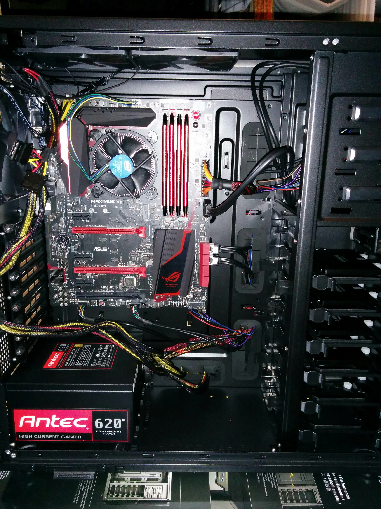
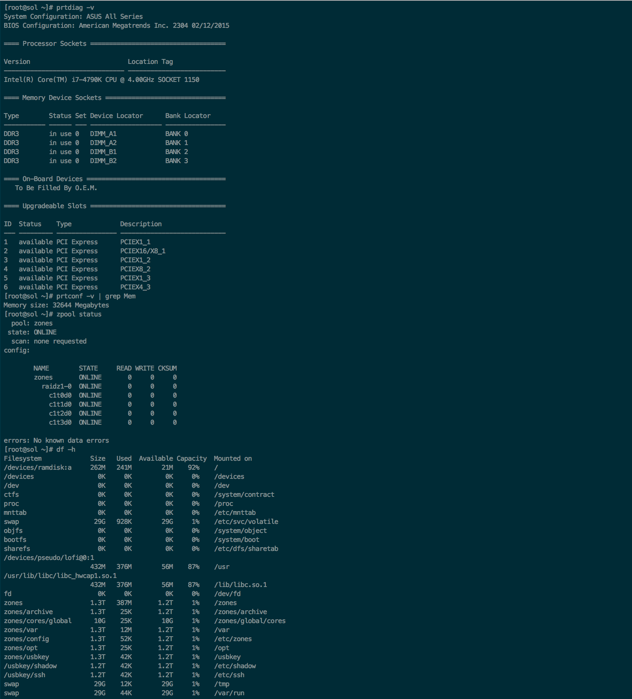

I have been working slowly with [OpenIndiana](https://www.openindiana.org) and 
[OmniOS](https://omnios.omniti.com) the past year mostly using them through 
VirtualBox on a Macbook Pro. The problem with this is for any sort of serious 
development (especially kernel development) you are limited to the performance 
of a guest OS installed on VirtualBox running in OSX on a Macbook Pro. Using AWS 
or another cloud solution would be costly in the long run and you always would 
have the extra paranoia of someone attacking your servers. This is more headache 
than it is worth especially for a small personal setup.

The solution for me was to build a dedicated workstation to be able to use as 
storage server (as my current setup of several USB drives is not scaleable), 
build and test [illumos](https://illumos.org) kernels. 

#### The Specs

Initially I was going to build as cheap as I could using an i5, 8GB RAM and 
10k RPM disks but I decided against that, since I wanted this build to be an 
investment. It not only will be my testing ground but I will use it as a file-
server, webserver etc. After some research I settled on the following:

* Intel Core i7 4790k
* Asus Maximus Hero VII
* Corsair Vengence Pro PC1600 (4 x 8GB)
* Samsung EVO 850 500GB SSD (x 4)
* Antec P280 Case
* Antec HCG-620 Power Supply

The RAM and disks are over specced as memory and disk IO will be crucial during 
kernel builds. I have used Samsung EVO SSDs before and I'm quite happy with 
their performance.

For the operating system I will be using [SmartOS](https://smartos.org) running 
on a tiny SanDisk 32GB USB drive. I really like what Joyent is doing with 
SmartOS and since I prefer to separate my build environment from my development 
and fileservers, this would allow me to deploy the VMs knowing I am getting good 
performance on the metal.

#### The Build

The build is nothing complex. No special cooling systems for overclocking. 

#### Installing SmartOS

Installing SmartOS is simply a matter of ensuring your BIOS has virtualization 
enabled and having a working internet connection. I chose RAIDZ as I did not 
want to sacrifice too much space having only four 500GB disks. This gave me 
1.3TB to work with.

#### Installing OmniOS as a guest VM

[OmniOS](https://omnios.omniti.com) is a server class operating system built on 
the illumos kernel. The distrbution itself is quite lean which makes it a good 
candidate to build upon. The workstation will be made up of multiple OmniOS VMs 
for development and file hosting.

SmartOS provides a number of images which are ready to download and install. You 
can find them using the imgadm command.

    imgadm avail

This will list all the images available from Joyent for installation. Some 
images will not be available (such as OmniOS) so for this we must install it 
manually.

The first step is to create a JSON payload with information on the VM specs. 
There are many different options to choose from but for a start here is one 
which works well for my build. You may want to adjust vcpu and ram details. 
Save this file as omnios.json under /usbkey so it is not lost on a reboot.

    {
      "brand": "kvm",
      "resolvers": [
        "8.8.8.8",
        "8.8.4.4"
      ],
      "ram": "2048",
      "vcpus": "2",
      "nics": [
       {
        "nic_tag": "admin",
        "ip": "192.168.1.10",
        "netmask": "255.255.255.0",
        "gateway": "192.168.1.1",
        "model": "virtio",
        "primary": true
       }
      ],
      "disks": [
       {
        "boot": true,
        "size": "40960",
        "model": "ide"
     }
    ]
  }

One important item to notice is the "model" variable under the "disks" section. 
This specifies that the disk uses the ide driver. Ideally we should be using the 
virtio driver but the OmniOS installer does not load it in time which results in 
the installer failing to find the disks on the system. So for now we use the ide 
driver and will revert to virtio after the install is complete.

Create the VM using the vmadm command as follows.

    vmadm create -f omnios.json

It should return with the ouput:

    Successfully created VM 68f0a396-0d00-4114-bebb-258d2ec454b1

The UUID is the new VM just created and can be seen under vmadm list.

    [root@sol ~]# vmadm list
    UUID                                  TYPE  RAM      STATE             ALIAS
    68f0a396-0d00-4114-bebb-258d2ec454b1  KVM   2048     running           -

The VM is now ready to be booted with the install ISO. To do this we need to 
download the ISO to the root directory of the VM.

    [root@sol /zones/68f0a396-0d00-4114-bebb-258d2ec454b1/root]# wget http://omnios.omniti.com/media/OmniOS_Text_r151016.iso

Once the ISO is downloaded, boot up the VM with the ISO and connect using VNC.

    vmadm boot 68f0a396-0d00-4114-bebb-258d2ec454b1 order=cd,once=d cdrom=/OmniOS_Text_r151016.iso,ide 

The VNC information can be retreived from the vmadm info command.

    [root@sol ~]# vmadm info 68f0a396-0d00-4114-bebb-258d2ec454b1
    {
      "status": {
      "hwsetup": true,
      "singlestep": false,
      "running": true
    },
    .
    .
    .
    "vnc": {
      "host": "192.168.1.2",
      "port": 36412,
      "display": 30512
    },
    "spice": {}
    }

You can proceed to connect using a VNC client to 192.168.1.2 on port 36412 and 
follow the OmniOS installation. Once complete the final task before proceeding 
with the [OmniOS post-install steps](http://omnios.omniti.com/wiki.php/GeneralAdministration) 
is to revert the disk driver from ide to virtio.

Shutdown the VM using the vmadm stop command.

    vmadm stop 68f0a396-0d00-4114-bebb-258d2ec454b1

Create a JSON file under /usbkey called update-driver.json and populate it as 
follows.

    {
    "update_disks": [
      {
        "path": "/dev/zvol/rdsk/zones/68f0a396-0d00-4114-bebb-258d2ec454b1-disk0",
        "model": "virtio"
      }
     ]
    }

Next update the VM with the new driver.

    vmadm update -f update-driver.json

The device cache still needs to be updated so to do this boot the installer ISO 
again.

    vmadm boot 68f0a396-0d00-4114-bebb-258d2ec454b1 order=cd,once=d cdrom=/OmniOS_Text_r151016.iso,ide

At the installation menu choose the option to drop to the shell prompt and enter 
the following commands to refresh the device cache.

    zpool import rpool
    zpool export rpool

The VM can now be rebooted and the post-installation tasks can be carried out.

#### Useful links

* Creating a VM in SmartOS - <https://wiki.smartos.org/display/DOC/How+to+create+a+Virtual+Machine+in+SmartOS>
* Creating a KVM VM - <https://wiki.smartos.org/display/DOC/How+to+create+a+KVM+VM+%28+Hypervisor+virtualized+machine+%29+in+SmartOS>
* vmadm JSON Quick Reference - <https://wiki.smartos.org/display/DOC/vmadm+JSON+Quick+Reference>
* OmniOS post-install steps - <http://omnios.omniti.com/wiki.php/GeneralAdministration>